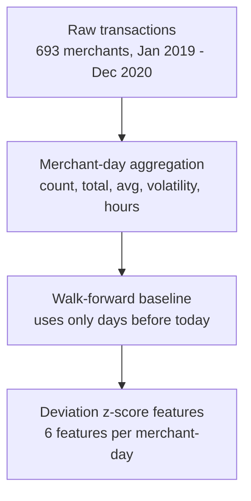
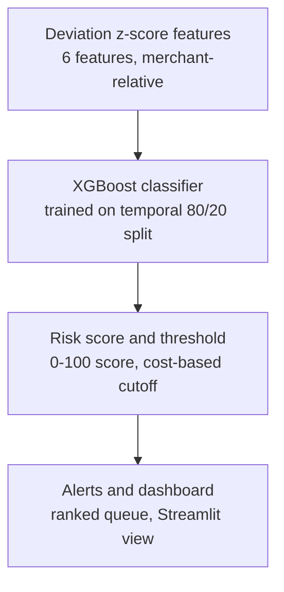

# Fraud-Spike Detector

**Razorpay AI Buildathon 2026 — Track 02: AI Risk Manager**

Detects when a merchant's transaction behavior deviates anomalously — in *shape*, not just volume — from their own historical pattern, distinguishing genuine demand-driven spikes (festivals, sales) from anomalous ones, and produces a confidence-scored risk alert.

## Problem statement

Given a merchant's transaction history, flag days where their behavior looks statistically unusual **relative to their own normal pattern** — not against one fixed rule for every merchant. A big merchant's busy day looks nothing like a small merchant's busy day, so "unusual" only makes sense merchant-by-merchant.

We are explicitly **not** trying to classify *why* a day looks unusual (money laundering, stolen cards, fake transactions, etc.) — those are all possible real-world explanations for the same statistical signal. The model has one job: detect the anomaly. The reasoning about cause is left to a human reviewer, aided by the explanation the system attaches to each alert.

## Dataset

[Kartik2112 Credit Card Transactions Fraud Detection](https://www.kaggle.com/datasets/kartik2112/fraud-detection) (Kaggle) — simulated Sparkov transaction data.

- `fraudTrain.csv`: Jan 2019 – Jun 2020 (~1.3M transactions, 693 merchants)
- `fraudTest.csv`: Jun 2020 – Dec 2020 (~556K transactions, same 693 merchants)
- Fraud rate: ~0.58%, spread across 679 of 693 merchants (diffuse, not a small ring of obviously-bad actors)
- Train and test are a **genuine temporal split** — train ends seconds before test begins — so train can be used as historical context and test as unseen future behavior.

**Honest caveat:** this is simulated data, not real payment data. Absolute metric values won't transfer directly to production — the *methodology* (merchant-relative, walk-forward anomaly detection) does.

## Architecture

**1. Data → features**



**2. Features → model → output**



## Key design decisions

**Merchant-day, not per-transaction, as the unit of analysis.** A "spike" is a pattern over time, not a property of one transaction — so every row the model sees is one merchant's one day, aggregated.

**Walk-forward, leakage-safe baselines.** An earlier version of this pipeline computed each merchant's "normal" behavior from their *entire* history, including days that hadn't happened yet relative to the day being scored — classic look-ahead bias. The fix: every merchant-day's baseline uses a cumulative sum shifted by one day (`shift(1)`), so it only ever sees that merchant's *past*. This mirrors exactly what a real, live system would know on any given date, and it's the single most important correctness decision in this project.

**XGBoost over Isolation Forest.** We tested an unsupervised Isolation Forest on the same deviation features first, since it needs no labels. It underperformed the supervised model — reasonable, given we have reliable fraud labels and severe class imbalance, which favors a model that can learn directly from confirmed examples. Reported honestly rather than omitted.

**Z-scores, not raw values.** A merchant that swings ±2 transactions/day naturally and one that swings ±15 naturally need different definitions of "unusual." Z-scores make merchants of any size comparable on the same scale.

**"Shape vs. scale."** A genuine demand spike (festival, sale) tends to scale a merchant's normal pattern up without distorting it — similar transaction sizes, similar hours. A fraud spike tends to distort the *shape* too — unusual transaction sizes, unusual timing. The average-amount and volatility z-scores are what capture this distinction, and empirically, they separate fraud-days from normal days far more clearly than raw transaction count does.

## Results (held-out test set, unseen merchants' future days)

| Metric | Value |
|---|---|
| Precision | 0.147 |
| Recall | 0.742 |
| ROC-AUC | 0.909 |
| PR-AUC | 0.238 |
| Alert rate | 8.35% |

Precision is modest by design — fraud-days are only ~1.7% of the test set, so this is expected under severe class imbalance. The strong ROC-AUC shows the model ranks risk well even before a specific threshold is chosen. Rather than reporting one cherry-picked threshold, the notebook sweeps a full precision/recall/false-positive-cost table so the operating point can be chosen based on real business cost trade-offs, not an arbitrary default.

## Limitations

- Simulated (Sparkov) data, not real payment data — methodology transfers, absolute numbers don't.
- Risk-level buckets (Low/Medium/High/Critical) are a fixed heuristic, not statistically calibrated.
- No dormancy/reactivation modeling — baselines are built only from each merchant's active days.
- Isolation Forest was tested and found weaker than the supervised model on this labeled dataset; likely a different story with less reliable labels.

## Repo structure

```
Fraud_Spike_Detector.ipynb   # full pipeline: data -> features -> model -> evaluation -> risk scoring
dashboard.py                 # Streamlit demo reading the notebook's saved output CSVs
README.md
```

## How to run

> Note: the raw dataset and the generated output CSVs are not included in this repo (see `.gitignore`) — the dataset is a public Kaggle download too large for GitHub, and the outputs are fully reproducible from the notebook. Step 2 below must be run before step 3, since it's what generates the CSVs the dashboard reads.

1. Download `fraudTrain.csv` and `fraudTest.csv` from the [Kaggle dataset](https://www.kaggle.com/datasets/kartik2112/fraud-detection) and place them alongside the notebook.
2. Run `Fraud_Spike_Detector.ipynb` top to bottom. This installs `xgboost`, builds the walk-forward features, trains the model, evaluates it, and saves four CSVs (`merchant_daily_risk.csv`, `risk_alert_queue.csv`, `merchant_risk_summary.csv`, `final_model_metrics.csv`) in the same folder.
3. Run the dashboard:
   ```
   pip install streamlit plotly
   streamlit run dashboard.py
   ```

## Track alignment

Built for Razorpay AI Buildathon Track 02 (AI Risk Manager): *"Stop the merchant losing money to fraud, returns and chargebacks."* This project targets one class of loss — fraud — with a detector (not an offense-capable system), honest precision/recall/false-positive-cost metrics on a held-out set, and a defense-only design.
